# Conectividad y transformación de datos en Power BI

Preparación de un set de ventas (`VENTAS_EXPORT`, archivo `Ventas_export_legacy.xlsx`) para el análisis, usando Power Query. El resultado son dos tablas limpias e independientes, `Clientes` y `Transacciones`, relacionadas por `id_cliente`.

**Contenido del repositorio:** este README, el archivo de trabajo `práctica.pbix`, el código M de cada consulta (`ventas_export.pq`, `clientes.pq`, `transacciones.pq`) y las capturas (`image1.png` a `image28.png`). Todo lo que muestran las capturas también está explicado en texto y en código.

---

## 1. Carga del archivo

Se importa el archivo Excel con el conector **Libro de Excel** y se selecciona la hoja `VENTAS_EXPORT`. Antes de confirmar la carga se revisó la vista previa para verificar que las columnas y los datos fueran coherentes.

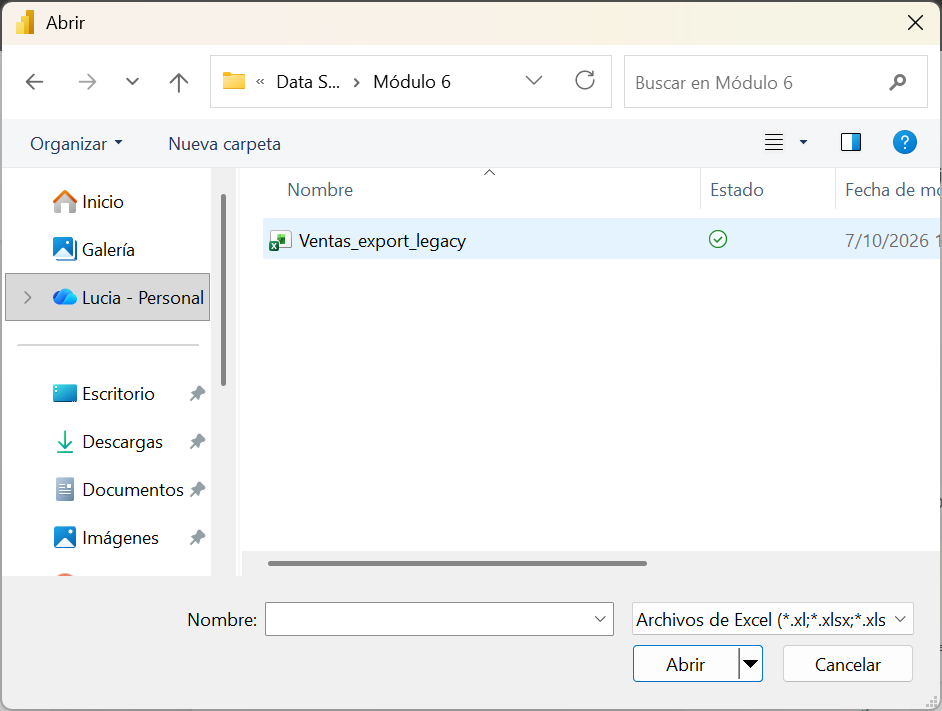

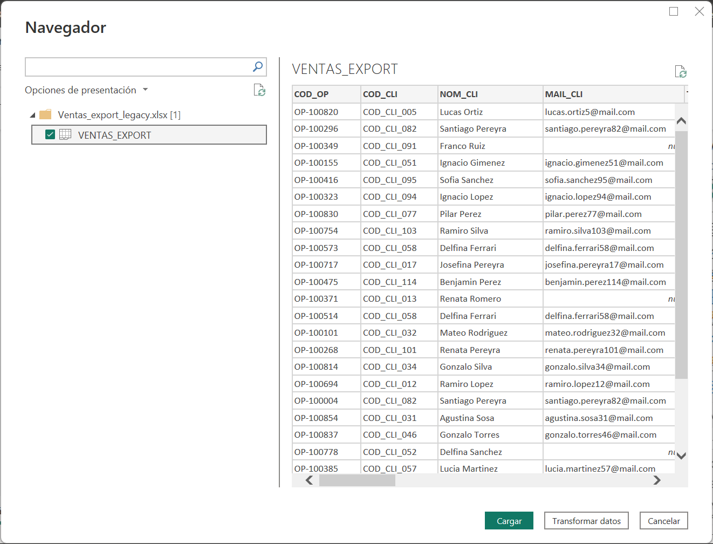

---

## 2. Transformaciones aplicadas y orden

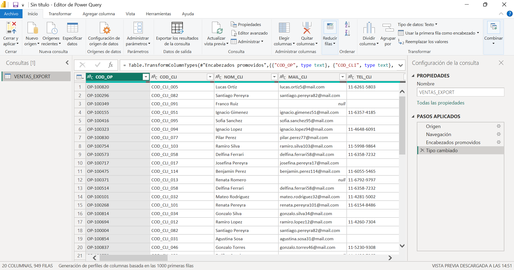

### 2.1 Pasos aplicados, en orden (consulta `VENTAS_EXPORT`)

| # | Paso en Power Query | Qué hace |
|---|---|---|
| 1 | Origen / VENTAS_EXPORT_Sheet | Abre el libro y toma la hoja `VENTAS_EXPORT`. |
| 2 | Encabezados promovidos | La primera fila pasa a ser el encabezado de las columnas. |
| 3 | Tipo cambiado | Asigna el tipo inicial de cada columna (IDs y descripciones como texto, `F_ALTA_CLI` como fecha, `COD_PROD` y `CANT` como enteros, montos como número). |
| 4 | Columnas con nombre cambiado | Renombra las 20 columnas técnicas con nombres descriptivos (tabla 2.2). |
| 5 | Filas filtradas (y `1`, `2`, `3`) | Revisiones de los valores de las columnas con el filtro. Usan la condición `each true`, es decir, no excluyen ninguna fila. |
| 6 | Tipo cambiado1 | `id_producto` pasa de número entero a texto. |
| 7 | Filas en blanco eliminadas | Elimina las filas completamente vacías. |
| 8 | Valor reemplazado | Nulos de `mail_cliente` por `N/D`. |
| 9 | Valor reemplazado1 | Nulos de `tel_cliente` por `N/D`. |
| 10 | Valor reemplazado2 | Nulos de `descuento` por `0`. |
| 11 | Tipo cambiado2 | `descuento` pasa a tipo Porcentaje. |
| 12 | Valor reemplazado3 | Nulos de `total_venta` por el valor calculado `cantidad * precio_unitario * (1 - descuento)`. |
| 13 | Tipo cambiado3 | `total_venta` se confirma como número decimal. |

### 2.2 Pasos adicionales de cada tabla final

Las consultas `Clientes` y `Transacciones` se crearon **duplicando** `VENTAS_EXPORT` después del paso 13, de modo que ambas heredan exactamente la misma limpieza. Cada una agrega sus propios pasos:

| Consulta | Pasos agregados |
|---|---|
| `Clientes` | **Otras columnas quitadas** (deja las 9 columnas del cliente), **Filas filtradas4** (revisión sin excluir filas) y **Duplicados quitados** (por `id_cliente`). |
| `Transacciones` | **Columnas quitadas** (quita las 8 columnas descriptivas del cliente y conserva `id_cliente`), **Duplicados quitados** (por `id_venta`) y **Tipo cambiado4** (`fecha_venta` pasa de fecha y hora a fecha). |

### 2.3 Por qué ese orden

- **Renombrar antes de limpiar:** los pasos de limpieza y la fórmula de `total_venta` usan los nombres descriptivos, y quedan legibles en el código.
- **Limpiar antes de separar:** si la limpieza se hace una sola vez, las dos tablas finales heredan datos ya corregidos, sin repetir trabajo ni arriesgar que cada tabla se limpie distinto.
- **`descuento` antes que `total_venta`:** la fórmula del total multiplica por `(1 - descuento)`. Con un nulo en `descuento` el resultado sería nulo, así que primero se completa con `0`.
- **Quitar duplicados al final, ya separadas las tablas:** en la tabla completa cada fila es distinta (cambia `id_venta`, producto, fecha, etc.), así que no hay duplicados de cliente que detectar. Recién al quedarse solo con las columnas del cliente aparecen las repeticiones, y al quedarse solo con los datos de la venta se puede verificar que cada `id_venta` sea único.

### 2.4 Renombrado de columnas

Se reemplazaron los nombres técnicos del sistema por nombres descriptivos, en `snake_case` y en español, para que cualquier usuario del reporte los entienda sin conocer el sistema original:

| Original | Nuevo |
|---|---|
| COD_OP | id_venta |
| COD_CLI | id_cliente |
| NOM_CLI | nombre_cliente |
| MAIL_CLI | mail_cliente |
| TEL_CLI | tel_cliente |
| CIU_CLI | ciudad_cliente |
| PROV_CLI | provincia_cliente |
| SEG_CLI | segmento_cliente |
| FLG_ACT | cliente_activo |
| F_ALTA_CLI | fecha_alta |
| F_VTA | fecha_venta |
| COD_PROD | id_producto |
| DESC_PROD | descripcion_producto |
| RUBRO_PROD | categoria |
| CANT | cantidad |
| PU_VTA | precio_unitario |
| DTO_PCT | descuento |
| TOT_VTA | total_venta |
| COD_MON | moneda |
| CANAL_VTA | canal_venta |

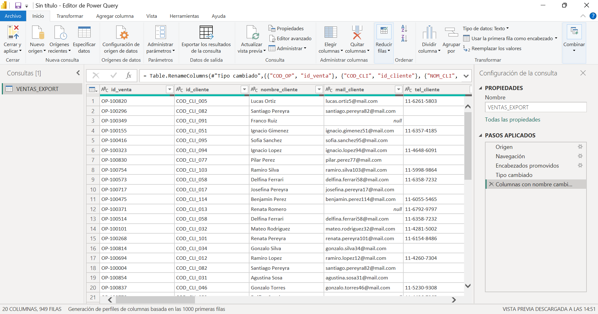

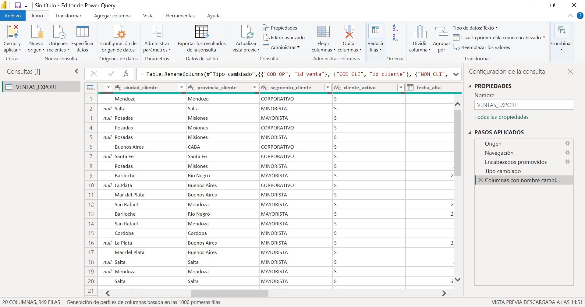

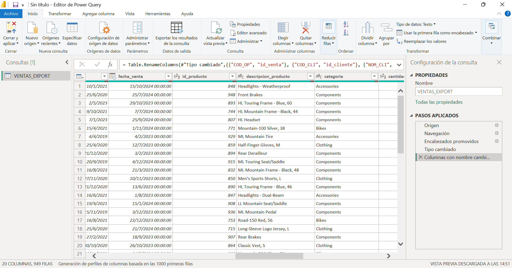

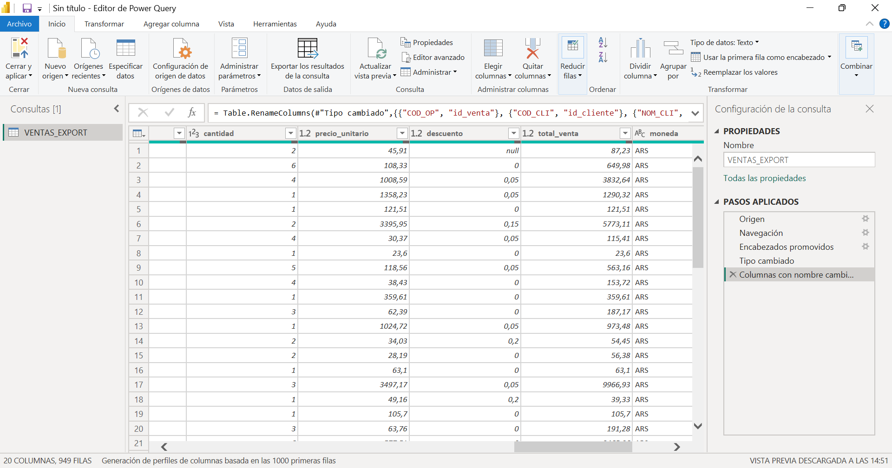

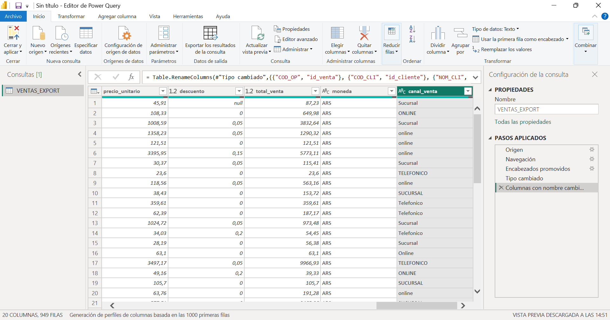

---

## 3. Tipos de datos elegidos

| Columna | Tipo | Por qué |
|---|---|---|
| id_venta, id_cliente | Texto | Son identificadores: sirven para distinguir registros y relacionar tablas, no para hacer cálculos. Como texto se evitan errores como perder ceros a la izquierda o que Power BI intente sumarlos. |
| id_producto | Texto | Venía como número entero. Es un código, no una cantidad: no tiene sentido sumarlo ni promediarlo, y como texto no se agrega por error en una visualización. |
| nombre_cliente, mail_cliente, tel_cliente, ciudad_cliente, provincia_cliente, segmento_cliente, descripcion_producto, categoria, moneda, canal_venta | Texto | Son descripciones o categorías. `tel_cliente` va como texto porque es un identificador de contacto, no un número con el que se opere. |
| cliente_activo | Texto | Es un indicador con valores tipo `S`/`N`, es decir, una categoría. |
| fecha_alta | Fecha | Es una fecha calendario. Con tipo Fecha se pueden usar filtros temporales y calcular antigüedad; como texto no se podría. |
| fecha_venta | Fecha | Venía como fecha y hora. Se convirtió a Fecha porque el análisis de ventas se hace por día, mes o año y la hora no aporta. Con tipo Fecha Power BI genera la jerarquía año/trimestre/mes/día. |
| cantidad | Número entero | Son unidades completas de producto. |
| precio_unitario, total_venta | Número decimal | Son montos con decimales sobre los que se calculan sumas, promedios y la fórmula del total. |
| descuento | Porcentaje | Representa un porcentaje, que se lee directamente (10 %) y se usa en la fórmula `1 - descuento`. |

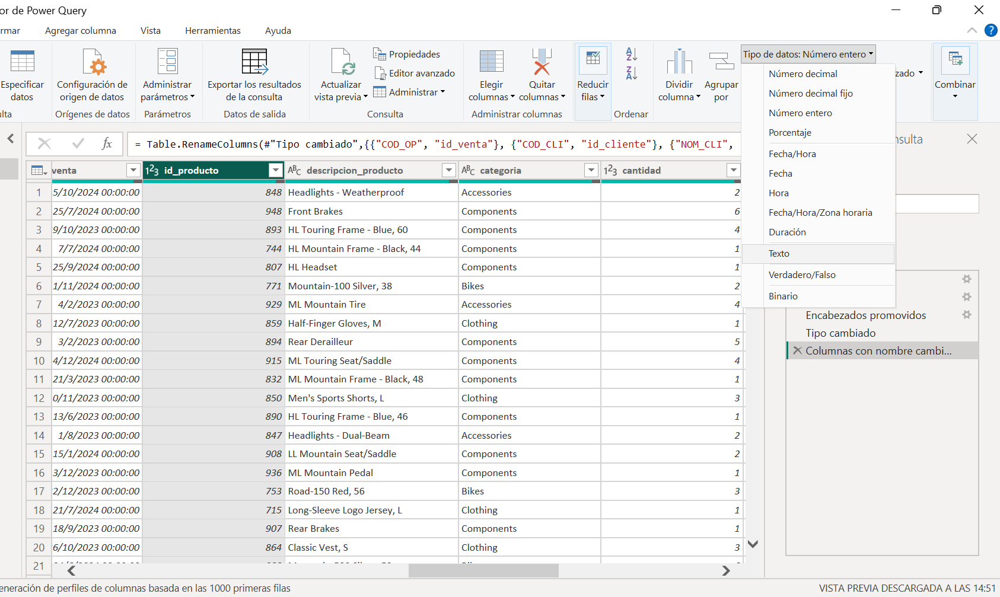

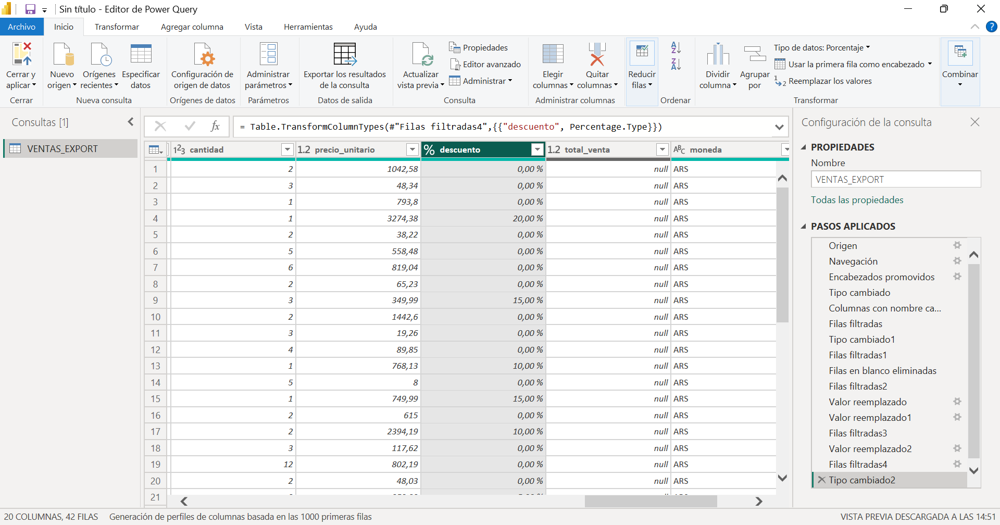

---

## 4. Valores nulos y duplicados

### 4.1 Nulos y filas vacías

| Columna | Qué se hizo | Justificación |
|---|---|---|
| Filas completamente vacías | Se eliminaron (paso *Filas en blanco eliminadas*). | No contienen ninguna información y distorsionarían conteos y promedios. |
| `mail_cliente` | Nulos reemplazados por `N/D`. | Es un dato descriptivo que no participa en cálculos. Eliminar la fila haría perder una venta válida. `N/D` mantiene el registro y evita celdas vacías que dificultan los filtros. |
| `tel_cliente` | Nulos reemplazados por `N/D`. | Mismo criterio que `mail_cliente`. |
| `descuento` | Nulos reemplazados por `0`. | Una venta sin descuento registrado se asume sin descuento. El `0` es el valor neutro de `1 - descuento`: con un nulo, el total daría nulo. |
| `total_venta` | Nulos reemplazados por `cantidad * precio_unitario * (1 - descuento)`. | Dejarlo en 0 subestimaría las ventas y distorsionaría totales y promedios; eliminar las filas perdería ventas reales. Como el total se puede calcular con datos que sí están, se recupera el valor correcto. |

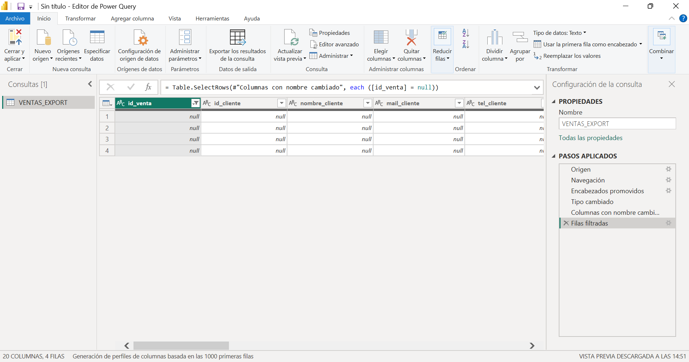

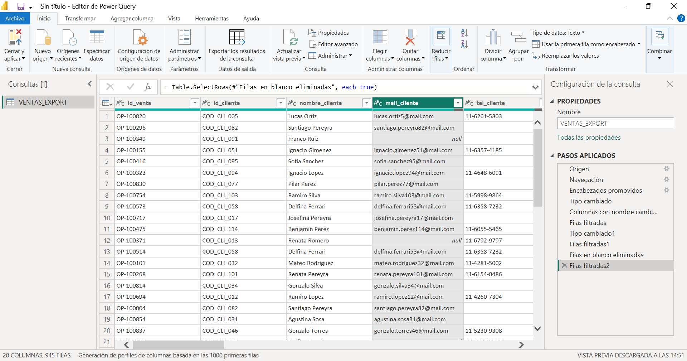

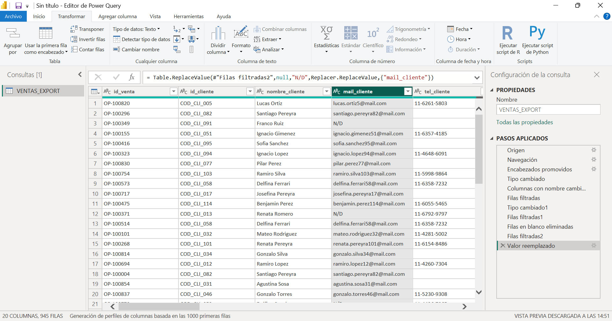

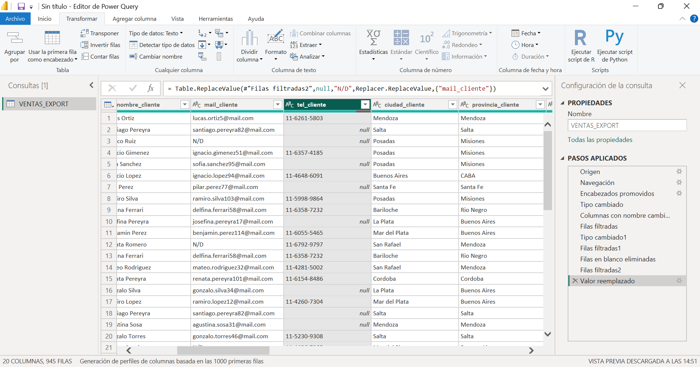

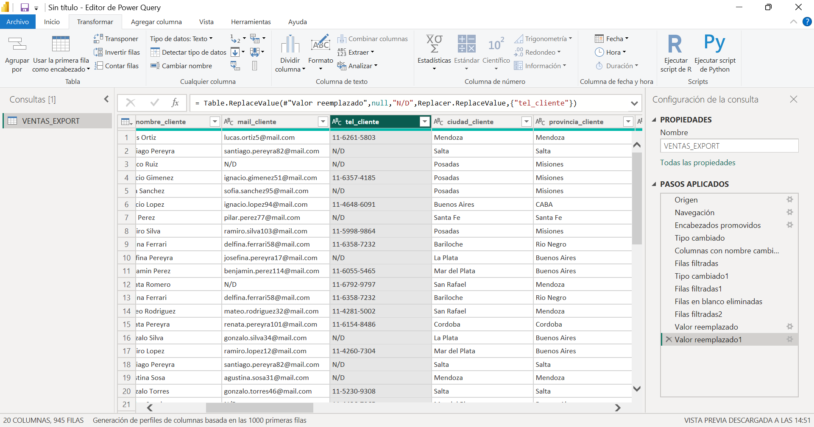

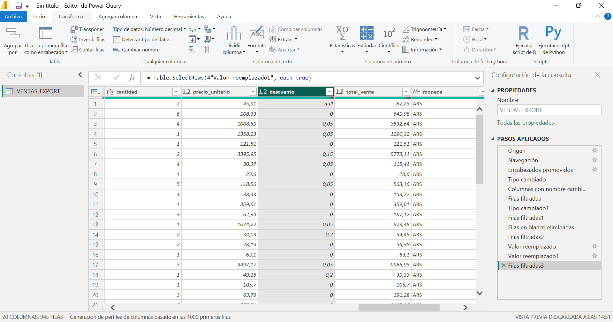

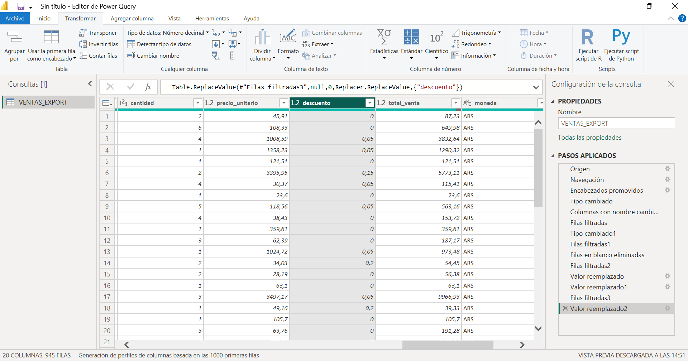

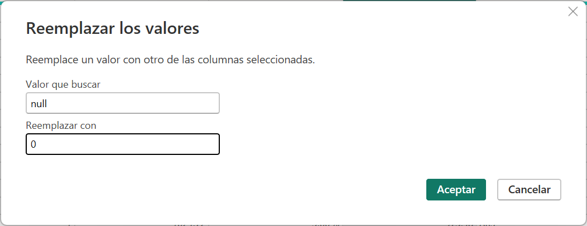

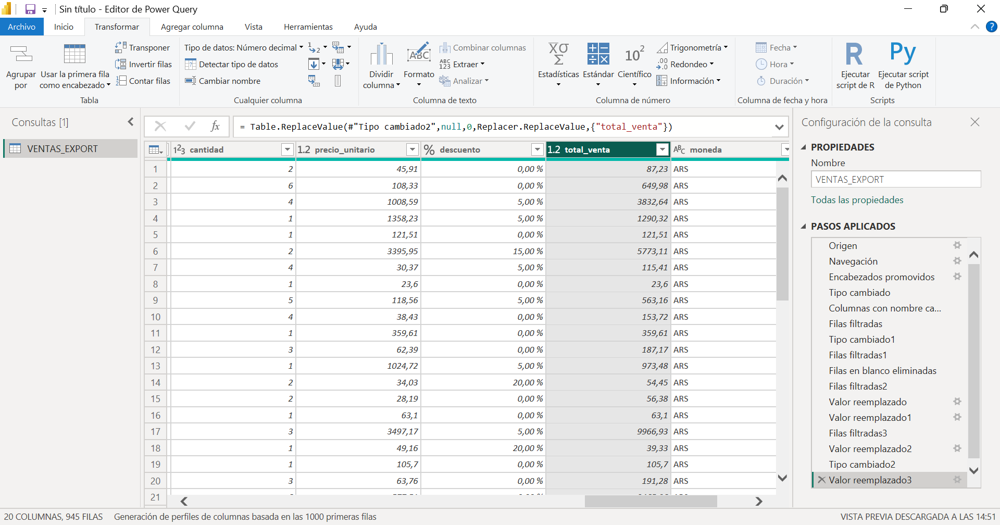

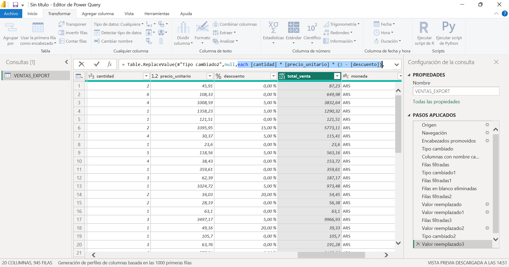

### 4.2 Duplicados

La tabla `VENTAS_EXPORT` tiene una fila por venta, así que los datos del cliente se repiten en cada compra. Por eso los duplicados se tratan en cada tabla final:

- **`Clientes`:** se aplicó **Quitar duplicados** sobre `id_cliente`. La tabla pasó de 945 filas a **119 clientes únicos**. Se conserva la primera aparición de cada cliente, y así `id_cliente` queda como clave primaria.
- **`Transacciones`:** se aplicó **Quitar duplicados** sobre `id_venta`, porque cada venta debe figurar una sola vez. La tabla tenía 945 filas antes del paso y quedó en **900 filas**.

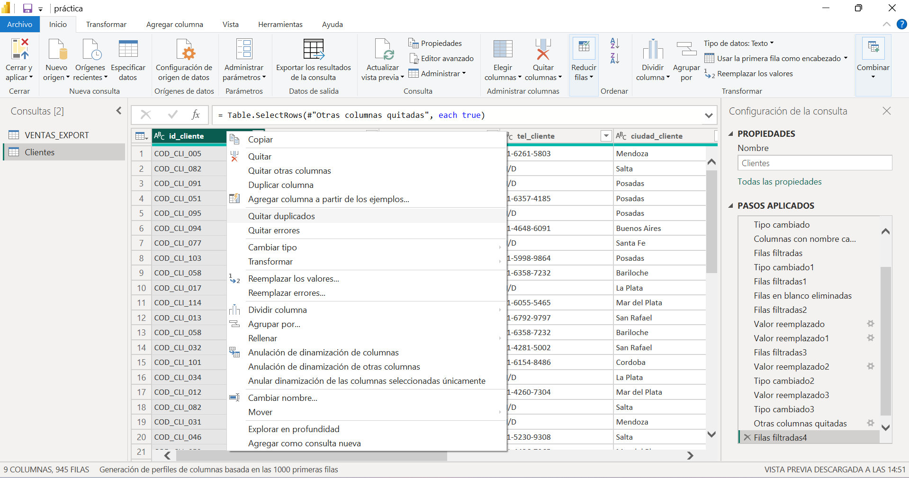

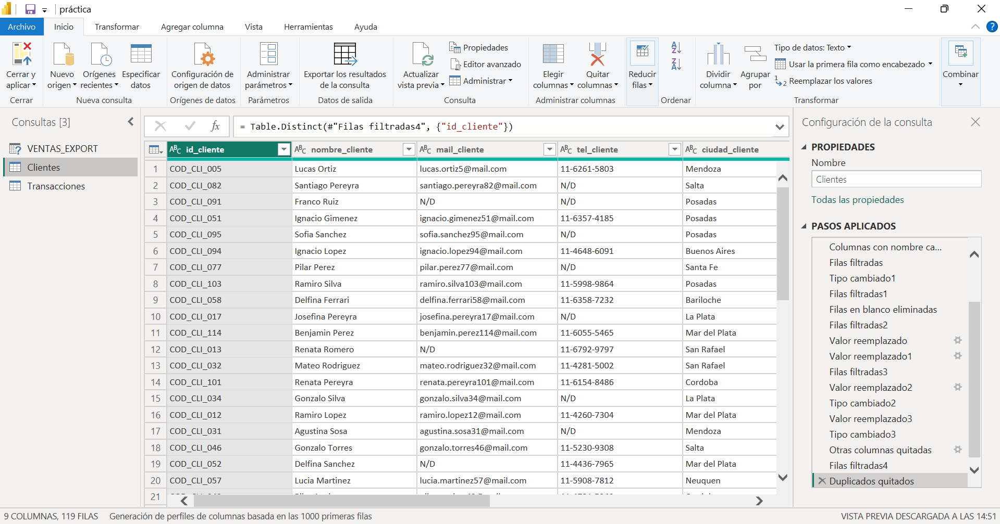

---

## 5. Separación de Clientes y Transacciones

**Procedimiento:**

1. Se duplicó la consulta limpia `VENTAS_EXPORT`.
2. En `Clientes` se conservaron solo las columnas que describen al cliente (*Quitar otras columnas*).
3. En `Transacciones` se quitaron las columnas descriptivas del cliente (*Quitar columnas*), conservando `id_cliente`.

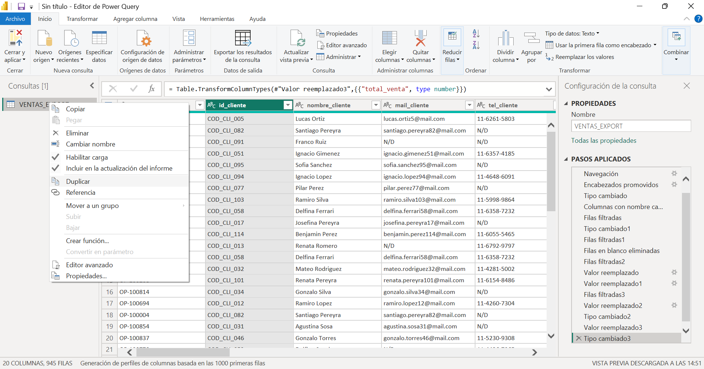

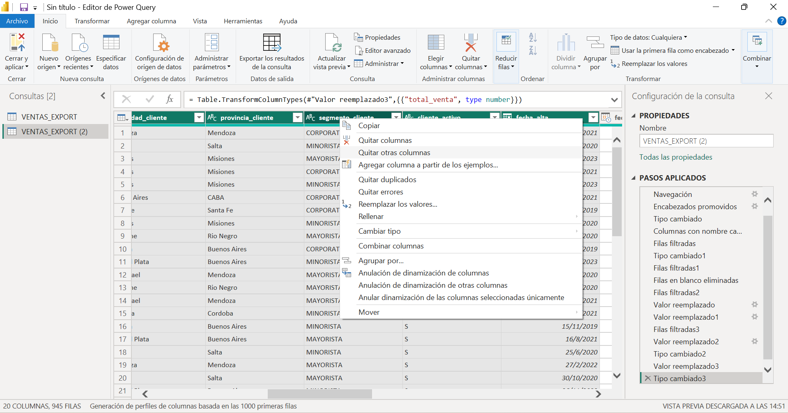

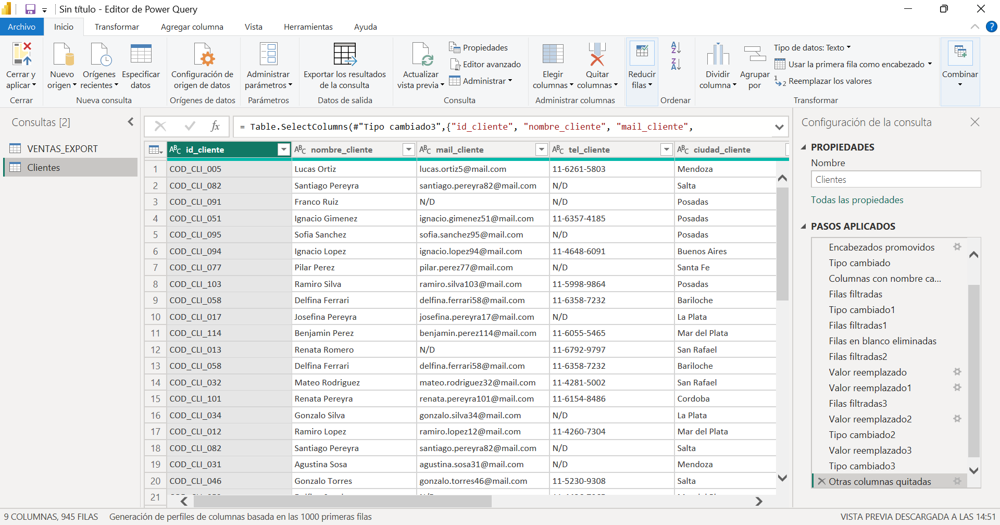

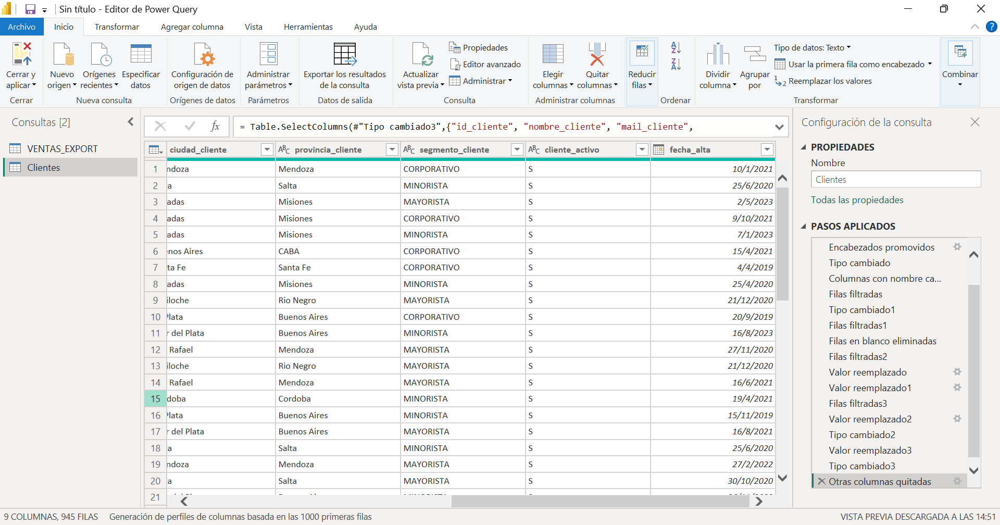

**Criterio de separación:** un dato pertenece a **Clientes** si describe a la persona y es el mismo en todas sus compras. Pertenece a **Transacciones** si cambia en cada operación.

| Tabla | Columnas | Criterio |
|---|---|---|
| `Clientes` | id_cliente, nombre_cliente, mail_cliente, tel_cliente, ciudad_cliente, provincia_cliente, segmento_cliente, cliente_activo, fecha_alta | Atributos del cliente: no varían entre una compra y otra. |
| `Transacciones` | id_venta, id_cliente, fecha_venta, id_producto, descripcion_producto, categoria, cantidad, precio_unitario, descuento, total_venta, moneda, canal_venta | Datos de cada operación: cambian en cada venta. |

`id_cliente` es la **clave que relaciona ambas tablas**: clave primaria en `Clientes` (valores únicos) y clave foránea en `Transacciones` (puede repetirse, un cliente compra varias veces). Separarlas evita repetir los datos del cliente en cada venta y permite modelar una relación uno a muchos.

### Tabla Transacciones

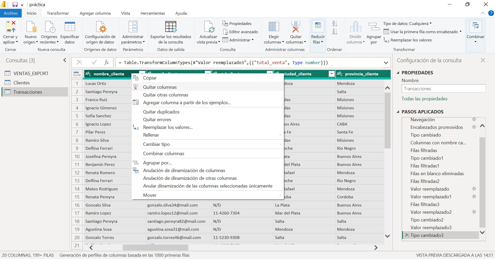

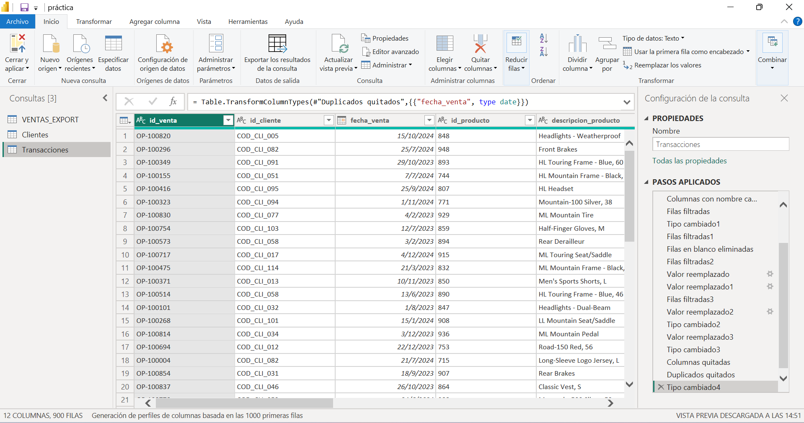

---

## 6. Código M de las consultas

El código completo de cada consulta (el mismo que muestra el **Editor avanzado**) está en los archivos `ventas_export.pq`, `clientes.pq` y `transacciones.pq`, y se incluye acá para poder revisarlo sin descargar nada.

<details>
<summary><strong>VENTAS_EXPORT</strong></summary>

```
let
    Origen = Excel.Workbook(File.Contents("C:\Users\Vymax\OneDrive\Escritorio\Data Science coder\Módulo 6\Ventas_export_legacy.xlsx"), null, true),
    VENTAS_EXPORT_Sheet = Origen{[Item="VENTAS_EXPORT",Kind="Sheet"]}[Data],
    #"Encabezados promovidos" = Table.PromoteHeaders(VENTAS_EXPORT_Sheet, [PromoteAllScalars=true]),
    #"Tipo cambiado" = Table.TransformColumnTypes(#"Encabezados promovidos",{{"COD_OP", type text}, {"COD_CLI", type text}, {"NOM_CLI", type text}, {"MAIL_CLI", type text}, {"TEL_CLI", type text}, {"CIU_CLI", type text}, {"PROV_CLI", type text}, {"SEG_CLI", type text}, {"FLG_ACT", type text}, {"F_ALTA_CLI", type date}, {"F_VTA", type datetime}, {"COD_PROD", Int64.Type}, {"DESC_PROD", type text}, {"RUBRO_PROD", type text}, {"CANT", Int64.Type}, {"PU_VTA", type number}, {"DTO_PCT", type number}, {"TOT_VTA", type number}, {"COD_MON", type text}, {"CANAL_VTA", type text}}),
    #"Columnas con nombre cambiado" = Table.RenameColumns(#"Tipo cambiado",{{"COD_OP", "id_venta"}, {"COD_CLI", "id_cliente"}, {"NOM_CLI", "nombre_cliente"}, {"MAIL_CLI", "mail_cliente"}, {"TEL_CLI", "tel_cliente"}, {"CIU_CLI", "ciudad_cliente"}, {"PROV_CLI", "provincia_cliente"}, {"SEG_CLI", "segmento_cliente"}, {"FLG_ACT", "cliente_activo"}, {"F_ALTA_CLI", "fecha_alta"}, {"F_VTA", "fecha_venta"}, {"COD_PROD", "id_producto"}, {"DESC_PROD", "descripcion_producto"}, {"RUBRO_PROD", "categoria"}, {"CANT", "cantidad"}, {"PU_VTA", "precio_unitario"}, {"DTO_PCT", "descuento"}, {"TOT_VTA", "total_venta"}, {"COD_MON", "moneda"}, {"CANAL_VTA", "canal_venta"}}),
    #"Filas filtradas" = Table.SelectRows(#"Columnas con nombre cambiado", each true),
    #"Tipo cambiado1" = Table.TransformColumnTypes(#"Filas filtradas",{{"id_producto", type text}}),
    #"Filas filtradas1" = Table.SelectRows(#"Tipo cambiado1", each true),
    #"Filas en blanco eliminadas" = Table.SelectRows(#"Filas filtradas1", each not List.IsEmpty(List.RemoveMatchingItems(Record.FieldValues(_), {"", null}))),
    #"Filas filtradas2" = Table.SelectRows(#"Filas en blanco eliminadas", each true),
    #"Valor reemplazado" = Table.ReplaceValue(#"Filas filtradas2",null,"N/D",Replacer.ReplaceValue,{"mail_cliente"}),
    #"Valor reemplazado1" = Table.ReplaceValue(#"Valor reemplazado",null,"N/D",Replacer.ReplaceValue,{"tel_cliente"}),
    #"Filas filtradas3" = Table.SelectRows(#"Valor reemplazado1", each true),
    #"Valor reemplazado2" = Table.ReplaceValue(#"Filas filtradas3",null,0,Replacer.ReplaceValue,{"descuento"}),
    #"Tipo cambiado2" = Table.TransformColumnTypes(#"Valor reemplazado2",{{"descuento", Percentage.Type}}),
    #"Valor reemplazado3" = Table.ReplaceValue(#"Tipo cambiado2",null,each [cantidad] * [precio_unitario] * (1 - [descuento]),Replacer.ReplaceValue,{"total_venta"}),
    #"Tipo cambiado3" = Table.TransformColumnTypes(#"Valor reemplazado3",{{"total_venta", type number}})
in
    #"Tipo cambiado3"
```
</details>

<details>
<summary><strong>Clientes</strong></summary>

```
let
    Origen = Excel.Workbook(File.Contents("C:\Users\Vymax\OneDrive\Escritorio\Data Science coder\Módulo 6\Ventas_export_legacy.xlsx"), null, true),
    VENTAS_EXPORT_Sheet = Origen{[Item="VENTAS_EXPORT",Kind="Sheet"]}[Data],
    #"Encabezados promovidos" = Table.PromoteHeaders(VENTAS_EXPORT_Sheet, [PromoteAllScalars=true]),
    #"Tipo cambiado" = Table.TransformColumnTypes(#"Encabezados promovidos",{{"COD_OP", type text}, {"COD_CLI", type text}, {"NOM_CLI", type text}, {"MAIL_CLI", type text}, {"TEL_CLI", type text}, {"CIU_CLI", type text}, {"PROV_CLI", type text}, {"SEG_CLI", type text}, {"FLG_ACT", type text}, {"F_ALTA_CLI", type date}, {"F_VTA", type datetime}, {"COD_PROD", Int64.Type}, {"DESC_PROD", type text}, {"RUBRO_PROD", type text}, {"CANT", Int64.Type}, {"PU_VTA", type number}, {"DTO_PCT", type number}, {"TOT_VTA", type number}, {"COD_MON", type text}, {"CANAL_VTA", type text}}),
    #"Columnas con nombre cambiado" = Table.RenameColumns(#"Tipo cambiado",{{"COD_OP", "id_venta"}, {"COD_CLI", "id_cliente"}, {"NOM_CLI", "nombre_cliente"}, {"MAIL_CLI", "mail_cliente"}, {"TEL_CLI", "tel_cliente"}, {"CIU_CLI", "ciudad_cliente"}, {"PROV_CLI", "provincia_cliente"}, {"SEG_CLI", "segmento_cliente"}, {"FLG_ACT", "cliente_activo"}, {"F_ALTA_CLI", "fecha_alta"}, {"F_VTA", "fecha_venta"}, {"COD_PROD", "id_producto"}, {"DESC_PROD", "descripcion_producto"}, {"RUBRO_PROD", "categoria"}, {"CANT", "cantidad"}, {"PU_VTA", "precio_unitario"}, {"DTO_PCT", "descuento"}, {"TOT_VTA", "total_venta"}, {"COD_MON", "moneda"}, {"CANAL_VTA", "canal_venta"}}),
    #"Filas filtradas" = Table.SelectRows(#"Columnas con nombre cambiado", each true),
    #"Tipo cambiado1" = Table.TransformColumnTypes(#"Filas filtradas",{{"id_producto", type text}}),
    #"Filas filtradas1" = Table.SelectRows(#"Tipo cambiado1", each true),
    #"Filas en blanco eliminadas" = Table.SelectRows(#"Filas filtradas1", each not List.IsEmpty(List.RemoveMatchingItems(Record.FieldValues(_), {"", null}))),
    #"Filas filtradas2" = Table.SelectRows(#"Filas en blanco eliminadas", each true),
    #"Valor reemplazado" = Table.ReplaceValue(#"Filas filtradas2",null,"N/D",Replacer.ReplaceValue,{"mail_cliente"}),
    #"Valor reemplazado1" = Table.ReplaceValue(#"Valor reemplazado",null,"N/D",Replacer.ReplaceValue,{"tel_cliente"}),
    #"Filas filtradas3" = Table.SelectRows(#"Valor reemplazado1", each true),
    #"Valor reemplazado2" = Table.ReplaceValue(#"Filas filtradas3",null,0,Replacer.ReplaceValue,{"descuento"}),
    #"Tipo cambiado2" = Table.TransformColumnTypes(#"Valor reemplazado2",{{"descuento", Percentage.Type}}),
    #"Valor reemplazado3" = Table.ReplaceValue(#"Tipo cambiado2",null,each [cantidad] * [precio_unitario] * (1 - [descuento]),Replacer.ReplaceValue,{"total_venta"}),
    #"Tipo cambiado3" = Table.TransformColumnTypes(#"Valor reemplazado3",{{"total_venta", type number}}),
    #"Otras columnas quitadas" = Table.SelectColumns(#"Tipo cambiado3",{"id_cliente", "nombre_cliente", "mail_cliente", "tel_cliente", "ciudad_cliente", "provincia_cliente", "segmento_cliente", "cliente_activo", "fecha_alta"}),
    #"Filas filtradas4" = Table.SelectRows(#"Otras columnas quitadas", each true),
    #"Duplicados quitados" = Table.Distinct(#"Filas filtradas4", {"id_cliente"})
in
    #"Duplicados quitados"
```
</details>

<details>
<summary><strong>Transacciones</strong></summary>

```
let
    Origen = Excel.Workbook(File.Contents("C:\Users\Vymax\OneDrive\Escritorio\Data Science coder\Módulo 6\Ventas_export_legacy.xlsx"), null, true),
    VENTAS_EXPORT_Sheet = Origen{[Item="VENTAS_EXPORT",Kind="Sheet"]}[Data],
    #"Encabezados promovidos" = Table.PromoteHeaders(VENTAS_EXPORT_Sheet, [PromoteAllScalars=true]),
    #"Tipo cambiado" = Table.TransformColumnTypes(#"Encabezados promovidos",{{"COD_OP", type text}, {"COD_CLI", type text}, {"NOM_CLI", type text}, {"MAIL_CLI", type text}, {"TEL_CLI", type text}, {"CIU_CLI", type text}, {"PROV_CLI", type text}, {"SEG_CLI", type text}, {"FLG_ACT", type text}, {"F_ALTA_CLI", type date}, {"F_VTA", type datetime}, {"COD_PROD", Int64.Type}, {"DESC_PROD", type text}, {"RUBRO_PROD", type text}, {"CANT", Int64.Type}, {"PU_VTA", type number}, {"DTO_PCT", type number}, {"TOT_VTA", type number}, {"COD_MON", type text}, {"CANAL_VTA", type text}}),
    #"Columnas con nombre cambiado" = Table.RenameColumns(#"Tipo cambiado",{{"COD_OP", "id_venta"}, {"COD_CLI", "id_cliente"}, {"NOM_CLI", "nombre_cliente"}, {"MAIL_CLI", "mail_cliente"}, {"TEL_CLI", "tel_cliente"}, {"CIU_CLI", "ciudad_cliente"}, {"PROV_CLI", "provincia_cliente"}, {"SEG_CLI", "segmento_cliente"}, {"FLG_ACT", "cliente_activo"}, {"F_ALTA_CLI", "fecha_alta"}, {"F_VTA", "fecha_venta"}, {"COD_PROD", "id_producto"}, {"DESC_PROD", "descripcion_producto"}, {"RUBRO_PROD", "categoria"}, {"CANT", "cantidad"}, {"PU_VTA", "precio_unitario"}, {"DTO_PCT", "descuento"}, {"TOT_VTA", "total_venta"}, {"COD_MON", "moneda"}, {"CANAL_VTA", "canal_venta"}}),
    #"Filas filtradas" = Table.SelectRows(#"Columnas con nombre cambiado", each true),
    #"Tipo cambiado1" = Table.TransformColumnTypes(#"Filas filtradas",{{"id_producto", type text}}),
    #"Filas filtradas1" = Table.SelectRows(#"Tipo cambiado1", each true),
    #"Filas en blanco eliminadas" = Table.SelectRows(#"Filas filtradas1", each not List.IsEmpty(List.RemoveMatchingItems(Record.FieldValues(_), {"", null}))),
    #"Filas filtradas2" = Table.SelectRows(#"Filas en blanco eliminadas", each true),
    #"Valor reemplazado" = Table.ReplaceValue(#"Filas filtradas2",null,"N/D",Replacer.ReplaceValue,{"mail_cliente"}),
    #"Valor reemplazado1" = Table.ReplaceValue(#"Valor reemplazado",null,"N/D",Replacer.ReplaceValue,{"tel_cliente"}),
    #"Filas filtradas3" = Table.SelectRows(#"Valor reemplazado1", each true),
    #"Valor reemplazado2" = Table.ReplaceValue(#"Filas filtradas3",null,0,Replacer.ReplaceValue,{"descuento"}),
    #"Tipo cambiado2" = Table.TransformColumnTypes(#"Valor reemplazado2",{{"descuento", Percentage.Type}}),
    #"Valor reemplazado3" = Table.ReplaceValue(#"Tipo cambiado2",null,each [cantidad] * [precio_unitario] * (1 - [descuento]),Replacer.ReplaceValue,{"total_venta"}),
    #"Tipo cambiado3" = Table.TransformColumnTypes(#"Valor reemplazado3",{{"total_venta", type number}}),
    #"Columnas quitadas" = Table.RemoveColumns(#"Tipo cambiado3",{"nombre_cliente", "mail_cliente", "tel_cliente", "ciudad_cliente", "provincia_cliente", "segmento_cliente", "cliente_activo", "fecha_alta"}),
    #"Duplicados quitados" = Table.Distinct(#"Columnas quitadas", {"id_venta"}),
    #"Tipo cambiado4" = Table.TransformColumnTypes(#"Duplicados quitados",{{"fecha_venta", type date}})
in
    #"Tipo cambiado4"
```
</details>

---

## 7. Cómo reproducir

1. Descargar `práctica.pbix` y abrirlo con Power BI Desktop.
2. En la pestaña **Inicio**, hacer clic en **Transformar datos**.
3. En el panel izquierdo aparecen las consultas `VENTAS_EXPORT`, `Clientes` y `Transacciones`.
4. Seleccionar cada una para ver su panel **Pasos aplicados** (a la derecha) y, en **Editor avanzado**, el código.
5. Si Power BI no encuentra el archivo de datos, cambiar la ruta en **Configuración de origen de datos** y apuntar a `Ventas_export_legacy.xlsx`. En el código figura la ruta del equipo donde se hizo el trabajo.

---

## 8. Cumplimiento de los criterios de aceptación

| Criterio | Dónde se cumple |
|---|---|
| El archivo se carga sin errores | Sección 1 y paso 1 del código |
| Nombres descriptivos en todas las columnas | Sección 2.4 (20 columnas renombradas) |
| Tipos de datos correctos | Sección 3 (cada tipo con su justificación) |
| Sin filas vacías en las tablas finales | Sección 4.1 (paso *Filas en blanco eliminadas*) |
| Sin duplicados en las tablas finales | Sección 4.2 (`Table.Distinct` por `id_cliente` y por `id_venta`) |
| Decisiones justificadas técnicamente | Secciones 2.3, 3, 4 y 5 |
| Separación Cliente / Transacción | Sección 5 |
